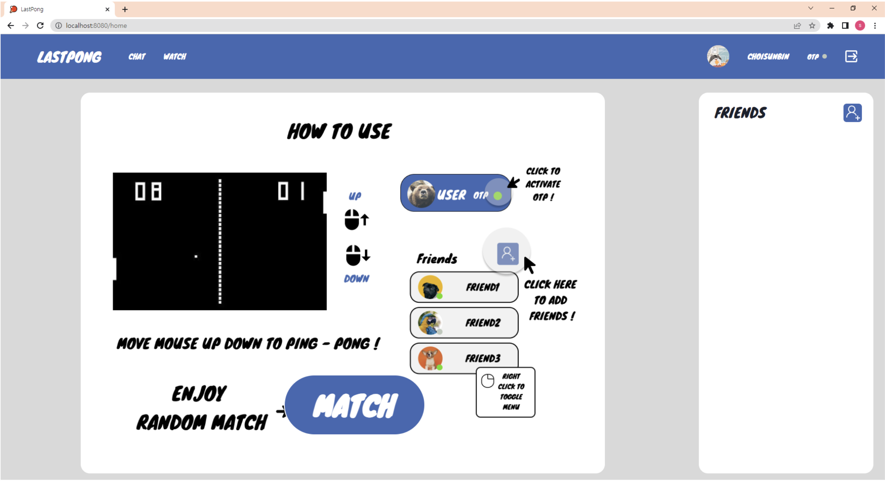
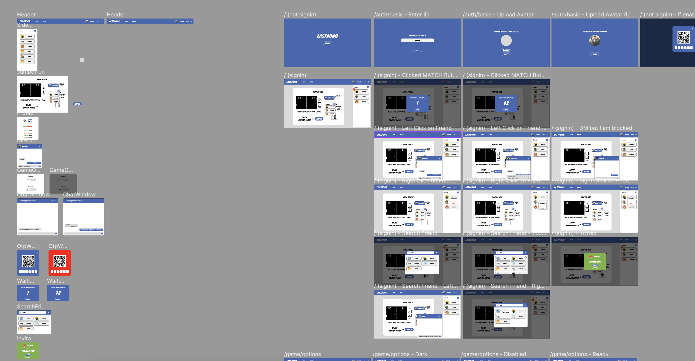

 

 
    

<h2> 🔨 Technologies Used 🔨 </h2>

<h3> 💡 Language 💡 </h3>
 
 

 
 
 

  
     
     
     
     
    
<h3> 💡 IDE 💡 </h3>
 
 
 
 
 

 
<h3> 💡 DataBase 💡 </h3>
     
     
     
    
 

<h3> 💡 ETC 💡 </h3>
 
 

 
 

 

<h2> 📞 Contact 📞 </h2>

 <h2> email : csn1434@naver.com </h2> 

##  💻 Project 💻 
 > 42서울 공통과정 마지막 과제 `ft_transcendence`
 - Git : https://github.com/lev-Zero/lastpong
 - 메인화면 : 
 - Figma : 
 자세한 디자인 시안은 [해당 링크](https://www.figma.com/community/file/1199421293253949642)에서 볼 수 있습니다.
 - 참여 파트 : Frontend 유저 인증 및 게임 로직 (Restful API, Socket io)